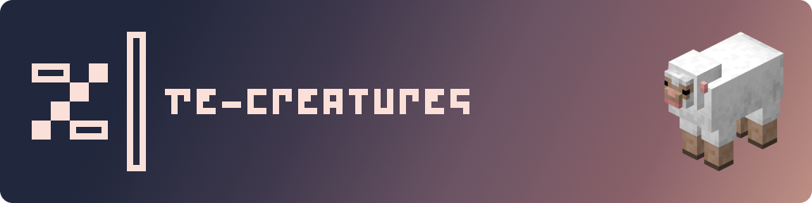

# Re-Creatures

## About

**Re-Creatures** is my personal vision for Minecraft mobs. The aim is to bring a little realism for the animals, and a more fantasy vibe for the monsters, all while following my [Adjustify](https://www.curseforge.com/linkout?remoteUrl=https%253a%252f%252fwww.planetminecraft.com%252ftexture-pack%252fadjustify%252f) vanilla-plus-ish style.

Changes go from the smallest texture and model changes like the squid, all the way to full overhauls like the cats. And some, like the villagers and iron golems, have a little bit of everything. You may even encounter "new mobs" like the pigmen farming away in a village.

## Dependencies

- [Optifine](https://optifine.net/home)

  **OR**
  
- [EMF - Entity Model Features](https://modrinth.com/mod/entity-model-features) + [ETF - Entity Texture Features](https://modrinth.com/mod/entitytexturefeatures)

## Additional Addon's

- RC x FA Addon **(WORK IN PROGRESS)**

## Credits & Acknowledgements 

- `none yet`

---

## Contributing

If you'd like to contribute to the development of Re-Creatures, here are some guidelines:

1. If you are familiar with GitHub, create a new issue, add your suggested additions, changes, improvements, and/or updates, and submit. 
2. If you are unfamiliar with GitHub, you can upload your suggested contribution on the discord server and it'll be uploaded as an issue on your behalf.

I'll then review and filter suggestions, and if they match with the vision of the project, they'll be added into the project.

> [!NOTE]
> For those who know what they are doing, please fork and pull into the `dev` branch.
> 
> This would be a great help, especially when it comes to updates and bug fixes!

---

## License and Use

This work is licensed under <a href="https://creativecommons.org/licenses/by-nc-sa/4.0/?ref=chooser-v1" target="_blank" rel="license noopener noreferrer" style="display:inline-block;">CC BY-NC-SA 4.0</a>

A **lot** of work goes into Resource Packs. 
Please respect the wishes of the authors, and consult with them before taking any action concerning their work.

Thank you kindly.
